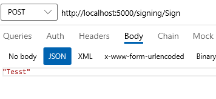
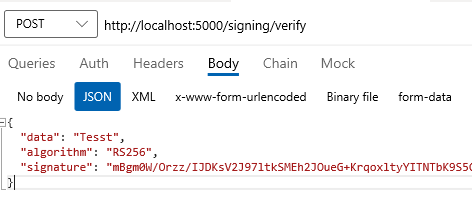
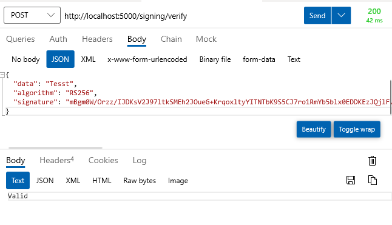
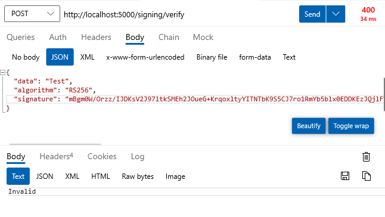

# Key Vault offline verification
Proof of concept demonstrating how to sign data using Azure Key Vault (.NET SDK) and how to verify this signature locally, without calling the Key Vault service again.

> There are two variants of this implementation:
>
> *  The Key Vault SDK has added the capability to provide cached `JsonWebKey`  to the `CryptographyClient` and make it work locally. It is currently available in version 4.2.0-beta.
> * As an alternative, we provide "manual" signature verification, using `RSAPKCS1SignatureDeformatter`.

## How to use

Follow the **Getting started - Create/Get credentials** steps described in the [Key Vault .NET SDK documentation](https://docs.microsoft.com/en-us/dotnet/api/overview/azure/security.keyvault.keys-readme) to set up the application. 

High-level initialization steps:

1. Create Azure Key Vault resource.
2. Create service principal for this application.
   1. `az ad sp create-for-rbac -n <your-application-name> --skip-assignment`
3. Set `AZURE_CLIENT_ID`, `AZURE_CLIENT_SECRET`, and`AZURE_TENANT_ID` appropriately.
4. Grant the service principal authorization to perform key operations on the Key Vault.
   1. `az keyvault set-policy --name <your-key-vault-name> --spn <AZURE_CLIENT_ID> --key-permissions backup delete get list create encrypt decrypt update sign verify`
5. Create a Key in Azure Key Vault.
6. Update `keyVaultName` and `keyName` constants in `SigningController.cs` to your respective resource names.

Once this configuration is done, you should be able to start the app and navigate to API endpoints.

* `POST http://localhost:5000/signing/sign` - This endpoint expects simple string body with content type of "application/json".
  * 
* `POST http://localhost:5000/signing/verify` - This endpoint expects JSON object containing `data`, `algorithm` and `signature`. 
  * 
  * For this sample, the algorithm will always be: `RS256`.
  * `signature` is Base64 encoded.

## How does it work

First request to this API (for any of the operations) fetches the public portion of specified key from Azure Key Vault and caches it in memory.

The `sign` operation is then using the standard .NET SDK to generate a data signature using key stored in Azure Key Vault. The signing operation itself **takes place outside of the application** - in Key Vault.

The `verify` operation doesn't reach out to Key Vault anymore, but uses the cached public key and .NET crypto APIs to validate signature of the provided data.

